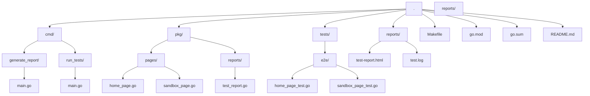

# GoLang_FRT_E2E_Tests

Este proyecto es un conjunto de pruebas de extremo a extremo (E2E) para FreeRangeTesters, escritas en Go.

## Estructura del proyecto

La estructura del proyecto es la siguiente:

## Directorios principales

* **cmd/generate_report**: Contiene el comando para generar informes de pruebas.
* **cmd**: Contiene los comandos para ejecutar las pruebas y generar informes.
* **pkg**: Contiene los paquetes de Go que se utilizan en el proyecto.
* **pages**: Contiene las definiciones de las páginas que se prueban, siguiendo el modelo POM (Page Object Model).
* **reports**: Contiene las funciones para generar informes de pruebas.
* **tests**: Contiene las pruebas de extremo a extremo.
* **e2e**: Contiene las pruebas de extremo a extremo para las páginas de FreeRangeTesters.
* **reports**: Contiene los informes de pruebas generados.

## Archivos principales

* **Makefile**: Contiene las reglas de construcción para el proyecto.
* **go.mod**: Archivo de gestión de dependencias de Go.
* **go.sum**: Archivo de verificación de dependencias.
* **README.md**: Documentación principal del proyecto.

## Requisitos previos

* Go instalado en el sistema.
* Dependencias de Go instaladas (`go mod download`).

## Ejecución de las pruebas

1. Ejecuta `go test -v ./...` para ejecutar todas las pruebas.
2. Ejecuta `go run cmd/generate_report/main.go` para generar un informe de pruebas.
3. Ejecuta `make test-report` para ejecutar todas las pruebas y generar un informe de estas en formato HTML.

## Informes de pruebas

Los informes de pruebas se generan en el directorio `reports`. 
El archivo `test-report.html` contiene el informe de pruebas en formato HTML.

## Contribución

Si deseas contribuir al proyecto, por favor, crea un fork del repositorio y envía una solicitud de pull request con tus cambios o sugerencias.

1. Crea un fork del repositorio
2. Realiza tus cambios o mejoras
3. Envía una solicitud de pull request con tus cambios o sugerencias